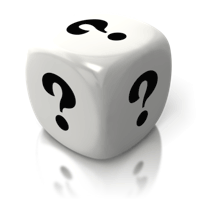

## What is Supervised Learning

There are few types of machine learning. Supervised Learning is one of them.

The fundamental concept is letting a system learn from lots of **labeled** data. 

After the learning, the system will be able to predict the result when new data come.

This is supervised learning. 

**Labeled** data means, we know the meaning of our data. Example can be, 

- Given fact, like house size, location, year of build, we know the price. Here the price is the label. House size, location and year of build are called features.
- Given a photo, we know whether is a cat. Here whether is a cat is the label. And photo is the features.

## How Learn a Cat is a Cat

When we were young, someone, likely our parents, told us that is a cat when we see a cat. 

So we just looked at the cat visually and label it as a cat.

And late on, when we see a cat, we predict it. 

- Sometime we are right, our parents will say good job.
- Sometime we are left,  our parents will say, no, that is a cat.

Over time, we will get better predication, super close to 100%.

Our parents are our supervisor in that case. We are learning in supervised way.

## Before Learning

Without previous knowledge, let a system tell whether a photo is a cat.

The system is a plain cubic box, it can only guess randomly. So the accuracy is 50%.



<!-- readmore -->

## After Learning

While if we give the cubic box enough **labeled** data, and let it learn **long enough**.

The plain cubic box will become a magic box. It will have high accuracy to tell whether a photo is a cat.


## How Good a Magic Box is

Of course we want our magic box able to

- Able to classify a photo is a cat if a coming photo is a cat
- Able to classify a photo is not a cat if a coming photo is not a cat

We can measure it with.

- give the magic box few **new** labeled photos
- the magic box do the classification
- compare the predicted result and expected result to get the accuracy. 

> **New** photos, means that the magic box has never see this photo before.

## How to Make a Good Magic Box

There are few general ways to get a better magic box.

1. Give it more photos
2. Use better algorithms
3. Buy more powerful machines
4. Let it learn long enough

We can always letting the box learn long enough. Though it would not be an option most of the time.

We could also buy more powerful machines, if we got enough money. Again, might not an option.

So most of time, we are spending time either getting more data or looking for better algorithms.

## Hello World Algorithm - Logistic Regression

Just like any other programming language, there is Hello World. 

In supervised learning world, it's Logistic Regression. **Logistics Regression** is a supervised learning algorithm to solve classification problems.

Yes. It's strange, **Logistics Regression** is used to solve classification problems.

If we take cat classification problem, denote

- every pixel as an input feature \\(x\\), denote as \\(x_1, x_2, x_3 ..., x_n\\)
- every pixel has a weight \\(w\\), denote as \\(w_1, w_2, w_3 ..., w_n\\)
- a bias value regardless of any pixel \\(b\\)

Logistics Regression use equations

$$z=w_1x_1+w_2x_2+w_3x_3+...+w_nx_n+b$$

$$y=\sigma(z)=\frac 1{1+e^{-z}}$$

By training it long enough, and we get a set of value \\(w_1, w_2, w_3 ..., w_n\\) and \\(b\\).

We will able to calculate the result by substitute the value \\(x_1, x_2, x_3 ..., x_n\\), \\(w_1, w_2, w_3 ..., w_n\\), \\(b\\) with the previous equation.

## How About Other Algorithms

So Logistic Regression sounds simple. How about other algorithms?

Theroatically it's just more equoations.

And of course, it will take lots of effort to make it work, and make it work better

Here is an example of a bit complex algorithm. It still able to draw every connections. 


For modern deep learning, it will not able to draw every connections since there are more than million connections.

## Why Machine Learning is Difficult

### Hard to Understand

One dimension is easy. We can easily figure it out. How about 2, 3, 4 dimensions?

Our brain will not able to plot it when its over 3 dimension. It will be difficult, if we can not make the algorithm a picture in our head

### Hard to Try

We could just try every combination if 

- Combination are in finite space
- Time cost is small
- Financial cost is small

While that is not the case for machine learning. It can not be done by brutal force. 

### Hard to Get Enough Cleaning Data

The world is complex. Data could be here, there, in this format, in that format, correct or incorrect.

It takes lots of time and effort to get **clean** data.

If we could not get enough clean data, no matter how good algorithm we have. It will goes to idiom "garbage in, garbage out".

## A Little Bit on Linear Algbra

It will not take more than 3 minutes.


$$
\begin{align*} 
1 * 7 + 2 * 9 + 3 * 11 &= 58\\
1 * 8 + 2 * 10 + 3 * 12 &= 64
\end{align*} 
$$

The first one [2, 3] matrix, and the second one is [3, 2] matrix, the result will be [2, 2] matrix.

In general, if we have a [m, n] matrix dot product [n, o] matrix, the result will be [m, o] matrix.

## Vectorize Logistic Regression

Recall the equations used Ligistic Regression 
$$
\begin{align*} 
z&=w_1x_1+w_2x_2+w_3x_3+...+w_nx_n+b \\
\hat y=a&=\sigma(z)=\frac 1{1+e^{-z}}
\end{align*} 
$$

If we set w as [1, dim] matrix, and x as [dim, 1] matrix. We can rewrite the previous equation as.

$$\begin{align*} 
z&=w\cdot x \\
[1, 1] &\Leftarrow [1, dim] \cdot  [dim, 1] 	
\end{align*}$$

If we stack all samples of x as [dim, m] matrix. Each column is one example. and stack all labels y together as [1, m]. Z has shape, [dim, m]. We can write the equation of the whole dataset as

$$\begin{align*} 
Z &= w\cdot X\\
[1, m] &\Leftarrow  [1, dim] \cdot  [dim, m]
\end{align*}$$

So after vectorize, we have following parameter and with the shape

|parameter|shape|
|:--------|:----|
| X       | [dim, m]|
| Y,A,Z   | [1,   m]|
| w       | [1, dim]|

## Implement Logistic Regression Forward Propagation

With the equations we have. We can simply implement **Logistic Regression** with **numpy**, which is a linear algebra library in Python.

We can create a test data and implement logistic regression forward propagation like this

```python
import numpy as np

## Generate test data
dim = 3                               # just tested with 3 dimentions
m = 10                                # just tested with 10 samples 
np.random.seed(1)                     # set seed, so that we will get predictable value for random
X = np.random.randn(dim, m)           # generate random [dim, m] matrix
Y = np.random.randint(2, size=(1, m)) # generate random int 0 or 1, matrix [1, m]

## Initialize parameter
w = np.random.randn(1, dim)           # generate inital weight with random value
b = 0.0                               # inital bias

## The following two lines are logistic regression forward propagation
Z = np.dot(w, X) + b                  # dot product w and X, then plus b. numpy will broadcast b
A = 1.0 / (1.0 + np.exp(-Z))          # sigmod function

print(A)
```

    [[ 0.05968404  0.97675612  0.66520774  0.68710686  0.12648752  0.8792792
       0.54440253  0.81416813  0.4697947   0.28029121]]

## Cost Function

**Lost function** is used to define how close a predict result to expected result.

In logistic regression, lost function for each example defined as

$$ \mathcal{L}(a, y) =  - y  \log(a) - (1-y)  \log(1-a)\tag{8}$$

There is an explanation by Andrew Ng about [why use this definition](https://www.coursera.org/learn/neural-networks-deep-learning/lecture/SmIbQ/explanation-of-logistic-regression-cost-function-optional).

**Cost function** is used to define how close for all predict result to expected result (**label**). The **cost function** defines as the average lost over all the training examples. 

$$ J = \frac{1}{m} \sum_{i=1}^m \mathcal{L}(a^{(i)}, y^{(i)})\tag{9}$$

Recall that A and Y are both is [1, m]. In order to get sum. We can write one line to get cost from A and Y. We will get an [1, 1] matrix just by dot product [1, m] and [m, 1] . 

$$J = -Y \cdot log(A.T) - (1 - Y) \cdot log(1-A.T)$$

And implemented with numpy in one line

```python
cost = -np.dot(Y, np.log(A.T)) - np.dot(Y, np.log(1 - A.T))
print(np.squeeze(cost))
```

    14.042604972431578

## Gradient Decent

If I'm dropped randomly in a ski resort, it is less likely that I'm dropped off at the lowest bottom. 

The gravity will pull you down on the slope when you ski.

| | |
|:-|:-|
| | |

We also need get the slope when training our model. By moving on the slope direction towards smaller cost, our model will getting better and better. This slope called gradient decent. It is the derivative of the cost function. 

As we define the cost function as 

$$ \mathcal{L}(\hat{y}, y^{(i)}) =  - y^{(i)}  \log(\hat y^{(i)}) - (1-y^{(i)} )  \log(1-\hat y^{(i)})\tag{8}$$

Based on the basic calculus equations. 

$$
\begin{align*} 
\big(f(x)g(x)\big)' &= f(x)g'(x)+f'(x)g(x) \\
\big(log(x)\big)'&=\frac1x\\
\frac{dz}{dx}=\frac{dz}{dy}.\frac{dy}{dx}=g'(y)f'(x)&=g'\big(f(x)\big)f'(x) \\
J &= \frac{1}{m} \sum_{i=1}^m \mathcal{L}(a^{(i)}, y^{(i)})\tag{9}
\end{align*} 
$$

We can get 

$$\begin{align*} 
\frac{\partial J}{\partial z} &= 
\frac{\partial J}{\partial \mathcal{L}} \cdot&
\frac{\partial \mathcal{L}}{\partial \mathcal{\hat y}}\cdot&
\frac{\partial \hat{y}}{\partial {z}}\cdot\\
&=1\cdot&-\frac y{\hat y}+\frac{1-y}{1-\hat y} \cdot&\hat y(1-\hat y)\\
&=\hat y - y\\
\\
\frac{\partial J}{\partial z} &= \frac{1}{m} \sum_{i=1}^m\frac{\partial \mathcal{L}}{\partial z}
\end{align*} $$

$$\begin{align*} 
dw&=(A - Y)\cdot X^T\\
[1, dim] &\Leftarrow [1, m] \cdot  [dim, m]^T \\
db&=\sum_{i=1}^m(A-Y)
\end{align*} $$

With the equation for \\(dw\\) and \\(db\\), we can easily implemented as.

```python
dw = np.dot(A - Y, X.T)
db = np.sum(A - Y)
print(dw, db)
```

    [[-3.34159415 -2.73182295  0.06338771]] -0.496821950101

## Backward Propogation

Just like when we are in a mountain, we can easy follow the slope to get to the valley. 
Since we as human is much smaller than the mountain.

How about a giant in the mountain. He might never get to the valley by fixed large step. 


Same apply to machine learning. We need to control the step, which is called learning rate \\(\alpha\\)to avoid to over shooting. 

After knowing the gradient decent \\(dw\\), \\(db\\) and controlling the learning rate \\(\alpha\\) we can update the weights \\(w\\) and bias \\(b\\) with following code.

```python
learning_rate = 0.005
w = w - learning_rate * dw
b = b - learning_rate * b
```

## Whole Algorithm

Just like we are in mountain. It's less likely that we will arrive to the valley in one step

The same applies to here, we need iterate many times, with all the previous preparations.

we can write Pseudo code like this.

```python
init weight
init bias

for i in range(number_iterations):
    forward_progation
    calculate cost
    stop iterate if cost already small enough
    
    calculate gradient decent
    update weights and bias
```

We can implement the previous pseudo code in two functions. 

```python
def propagate(w, b, X, Y):
    """
    w: weights, [1, m]
    b: bias, scalar value
    X: features, [dim, m]
    Y: labels,   [1, m]
    """
    m = X.shape[1]
    Z = np.dot(w, X) + b
    A = 1.0 / (1.0 + np.exp(-Z))
    
    dw = np.dot(A - Y, X.T) / m
    db = np.sum(A - Y) / m
    
    return dw, db, A
```

```python
def logistic_regression(X, Y, num_iterations=10, learning_rate=0.01):
    dim, m = X.shape
    w = np.zeros((1, dim)) # Initialize weights to zero
    b = 0.0                # Initialize bias    to zero
    
    costs = []             # save cost for each iteration
    
    for i in range(num_iterations):
        dw, db, A = propagate(w, b, X, Y)
        
        cost = -(np.dot(Y, np.log(A.T)) + np.dot(1-Y, np.log(1-A.T))) / m

        # update weights and bias
        w = w - learning_rate * dw
        b = b - learning_rate * db
        
        if i % 100 == 0:
            print(i, cost)
            
        costs.append(cost)
        
    return w, b, costs, A
```

## Get a Data Set

There is a cat data set from [coursera deep learning course](https://www.coursera.org/learn/neural-networks-deep-learning/notebook/zAgPl/logistic-regression-with-a-neural-network-mindset)

The data set is encoded in HDF5 format which is typically used to store numeric data. 

The following piece of code is copied from deep learning course to load the cat data

```python
import numpy as np
import h5py
    
    
train_dataset = h5py.File('../datasets/train_catvnoncat.h5', "r")
train_set_x_orig = np.array(train_dataset["train_set_x"][:]) # your train set features
train_set_y_orig = np.array(train_dataset["train_set_y"][:]) # your train set labels

test_dataset = h5py.File('../datasets/test_catvnoncat.h5', "r")
test_set_x_orig = np.array(test_dataset["test_set_x"][:]) # your test set features
test_set_y_orig = np.array(test_dataset["test_set_y"][:]) # your test set labels

classes = np.array(test_dataset["list_classes"][:]) # the list of classes

train_set_y = train_set_y_orig.reshape((1, train_set_y_orig.shape[0]))
test_set_y = test_set_y_orig.reshape((1, test_set_y_orig.shape[0]))
```

The shape of each sample is [64, 64, 3]. Both height and width are 64. 

Each pixel has 3 values for each channel, Red Green and Blue. 
The value range for each channel is from 0 which is darkest, to 255 which is the lightest.

we can use matplotlib plot a sample.

```python
import matplotlib.pyplot as plt
%matplotlib inline
plt.imshow(train_set_x_orig[10])

print(train_set_x_orig[10].shape)
print(train_set_x_orig[10][0, 0])

```

    (64, 64, 3)
    [188 180 119]


## Preprocess the Data

A photo has two dimension, x and y. Each point is a pixel. Each pixel in RGB photo has 3 value, Red, Green and Blue. In **Logistic Regression**, we need to convert to one dimension. 

**Normalize** data will be an important step. Since machine Learning will typically has better result by normalize the value to range [-1, 1], or [0, 1].

We can pre-process with the following code. 

And get dimension 12288 which is 64*64*3. 209 sample for training set and 50 for test set.

```python
m_train = train_set_x_orig.shape[0]                           # number of train samples
m_test = test_set_x_orig.shape[0]                             # number of test samples
num_px = train_set_x_orig.shape[1]                            # number pixel on x and y dimension

train_set_x = train_set_x_orig.reshape(m_train, -1).T / 255   # normalize pixel value to [0, 1]
test_set_x = test_set_x_orig.reshape(m_test, -1).T / 255

print(train_set_x.shape, test_set_x.shape)
```

    (12288, 209) (12288, 50)

## Train the Model with Logistic Regression

We can train model with the data set get weights, bias. 

```python
w, b, costs, A=logistic_regression(X=train_set_x, Y=train_set_y, num_iterations = 2000, learning_rate = 0.005)
```

    0 [[ 0.69314718]]
    100 [[ 0.58450836]]
    200 [[ 0.46694904]]
    300 [[ 0.37600687]]
    400 [[ 0.33146329]]
    500 [[ 0.30327307]]
    600 [[ 0.27987959]]
    700 [[ 0.26004214]]
    800 [[ 0.24294068]]
    900 [[ 0.22800422]]
    1000 [[ 0.21481951]]
    1100 [[ 0.20307819]]
    1200 [[ 0.19254428]]
    1300 [[ 0.18303334]]
    1400 [[ 0.17439859]]
    1500 [[ 0.1665214]]
    1600 [[ 0.15930452]]
    1700 [[ 0.15266732]]
    1800 [[ 0.14654224]]
    1900 [[ 0.14087208]]

```python
plt.plot(np.squeeze(costs))
plt.ylabel('cost')
plt.xlabel('iterations (per hundreds)')
plt.title("Learning rate =" + str(learning_rate))
plt.show()
```


```python
costs[:10]
```

    [array([[ 0.69314718]]),
     array([[ 0.74102941]]),
     array([[ 0.75315358]]),
     array([[ 0.8667087]]),
     array([[ 0.7685635]]),
     array([[ 0.89701447]]),
     array([[ 0.75561323]]),
     array([[ 0.88043664]]),
     array([[ 0.75148527]]),
     array([[ 0.87713305]])]

## How Good is the Model on the Sample it has Seen

```python
train_predict = np.where(A >= 0.5, 1, 0)
train_accuracy = np.sum(train_predict == train_set_y) / train_set_y.shape[1]
print("train accuracy", train_accuracy)

wrong_index = np.argmax(train_predict != train_set_y)
print("wrong predict on sample ", wrong_index, " to ", train_predict[:, wrong_index], "which should be", train_set_y[:, wrong_index])
plt.imshow(train_set_x_orig[wrong_index])
```

    train accuracy 0.99043062201
    wrong predict on sample  41  to  [0] which should be [1]

    <matplotlib.image.AxesImage at 0x7f69a56fc8d0>


Will you say that is a cat? :-(

## How Good is the Model on the Sample it has not seen

```python
def predict(w, b, X):
    Z = np.dot(w, X)
    A = 1.0 / (1.0 + np.exp(-Z))
    return np.where(A >= 0.5, 1, 0)

test_predict = predict(w, b, test_set_x)
test_accuracy = np.sum(test_predict == test_set_y) / test_set_y.shape[1]
print("test accuracy", test_accuracy)

wrong_index = np.argmax(test_predict != test_set_y)
print("wrong predict on sample ", wrong_index, " to ", test_predict[:, wrong_index], "which should be", test_set_y[:, wrong_index])
plt.imshow(test_set_x_orig[wrong_index])

```

    test accuracy 0.7
    wrong predict on sample  5  to  [1] which should be [0]

    <matplotlib.image.AxesImage at 0x7f69a58d64a8>


This seems is not a cat. :-(

## Why does the Model have Low Accuracy?

With previous logistic regression. We got training set accuracy 99%, and test set accuracy 70%.

70%, not very impressive, right. But why?

A simple answer is that the model is too simple to catch the characteristics. 

We will try to improve it in the next blog.
