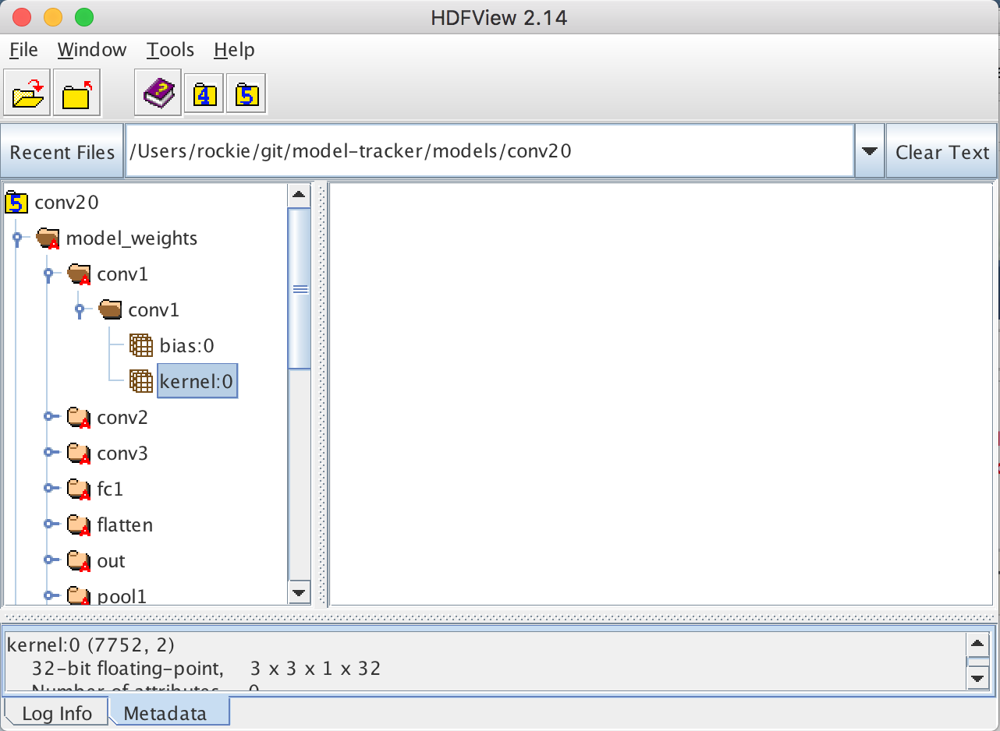
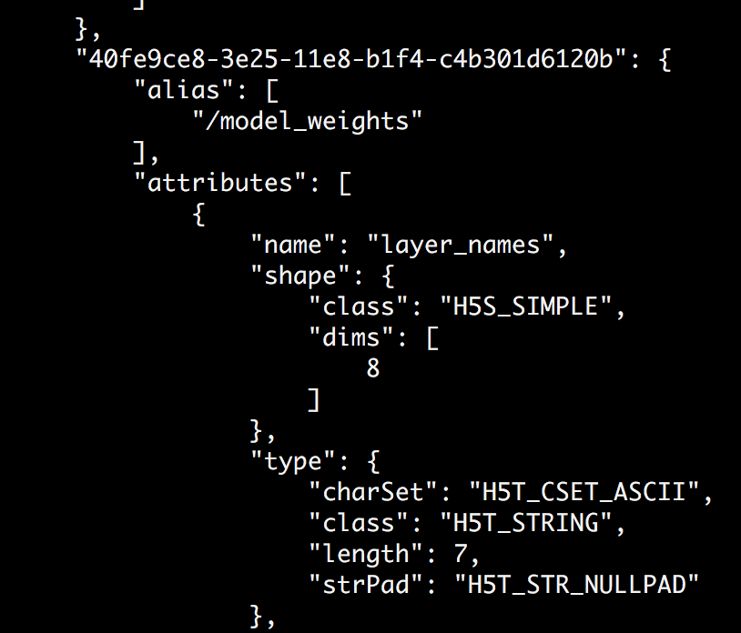

HDF5 is a file format which to store numerical data. 
It is widely used in Machine Learning space.

There are two main concept in HDF5

- Groups: work like dictionaries
- Datasets: work like NumPy arrays

## HDF5View application to view HDF file

HDF5View can be downloaded from [hdfgroup](https://support.hdfgroup.org/products/java/release/download.html) web page.

Open a file will have a view like this to navigate.

> There is also a python library [hdf5Viewer](https://pypi.python.org/pypi/h5pyViewer/) 
> While it does not support Python3.
> And there few dependencies not easy to fulfill on Mac

  
## [HDF5](http://docs.h5py.org/en/latest/) Handling with Python

Install h5py package
    
    pip install h5py

Import package

    import h5py

Open a file

    train_dataset = h5py.File('datasets/train_catvnoncat.h5', "r")

<!-- readmore -->

Get the direct child keys

    train_dataset.keys()
    # Direct calling keys will get the following output
    # Which can not determin what's inside
    # KeysView(<HDF5 file "train_catvnoncat.h5" (mode r)>)
    # While we could loop over it
    for key in train_dataset.keys():
        print(key)
    
    child_keys = [k for k in train_dataset.keys()]
    
Get all child keys 

    all_child_keys = []
    train_dataset.visit(all_child_keys.append)

Get child data set

    train_set_x = train_dataset['train_set_x']
    
    # Direct access a dataset will get the following output
        <HDF5 dataset "train_set_x": shape (209, 64, 64, 3), type "|u1">
    
Convert to the real array data by
 
    train_dataset['train_set_x'][:]
            
Write hdf5 file. The data in the following example is numpy array.

    data_set = np.random.randn(3, 4)
    classes = [b'cat', 'notcat'.encode('utf-8')]
    with h5py.File("dataset.hdf5", "w") as f:
        f.create_dataset(name="train_set_x", data=data_set, compression='gzip', compression_opts=9)
        f.create_dataset(name="classes", data=classes)

> The string data set write to HDF5 has to be encoded to binary.
  
> HDF5 support compression when create dataset

## hdf5 and json conversion

Install the python package with 

    pip install h5json
    
Convert a HDF5 file to json with

    python -m h5json.h5tojson.h5tojson convolutional.h5 > convolutional.json
    
Only output the structure by provide command line option -D

    python -m h5json.h5tojson.h5tojson -D convolutional.h5 > convolutional-structure-only.json

> The output json will have alias linked to inside. It is not always easy to interpret.

