# Spark Window Function

**Window** (also, windowing or windowed) functions perform a calculation over a set of rows.
It is an important tool to do statistics. Most Databases support Window functions. Spark from version 1.4 start supporting Window functions. 

Spark Window Functions have the following traits:

- perform a calculation over a group of rows, called the **Frame**.
- a frame corresponding to the current row
- return a new value to for each row by an aggregate/window function
- Can use SQL grammar or DataFrame API.

Spark supports multiple programming languages as the frontends, Scala, Python, R, and other JVM languages. This article will only cover the usage of Window Functions with Scala DataFrame API. 
It is very similar for Python DataFrame API, except few grammar differences.

For the usage of Windows function with SQL API, please refer to normal SQL guide.

## Import all needed package

Few objects/classes will be used in the article. Just import them all here for simplicity.

    import org.apache.spark.sql.expressions.Window
    import org.apache.spark.sql.types._
    import org.apache.spark.sql.functions._

## Sample Dataset

The sample dataset has 4 columns, 

- `depName`: The department name, 3 distinct value in the dataset.
- `empNo`: The identity number for the employee
- `salary`: The salary of the employee. Most employees have different salaries. While some employees have the same salaries for some demo cases.
- `hobby`: The list of hobbies of the employee. This is only used for some of the demos.

Here is the sample dataset

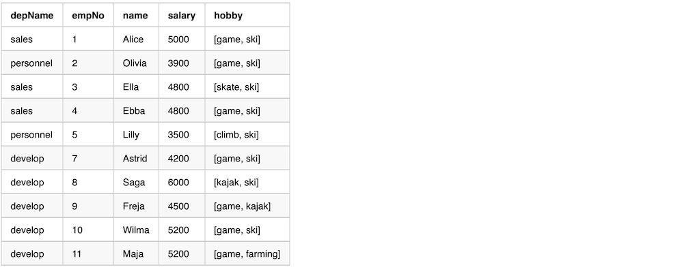

The following code can be used to create the sample dataset

    case class Salary(depName: String, empNo: Long, name: String, 
        salary: Long, hobby: Seq[String])
    val empsalary = Seq(
      Salary("sales",     1,  "Alice",  5000, List("game",  "ski")),
      Salary("personnel", 2,  "Olivia", 3900, List("game",  "ski")),
      Salary("sales",     3,  "Ella",   4800, List("skate", "ski")),
      Salary("sales",     4,  "Ebba",   4800, List("game",  "ski")),
      Salary("personnel", 5,  "Lilly",  3500, List("climb", "ski")),
      Salary("develop",   7,  "Astrid", 4200, List("game",  "ski")),
      Salary("develop",   8,  "Saga",   6000, List("kajak", "ski")),
      Salary("develop",   9,  "Freja",  4500, List("game",  "kajak")),
      Salary("develop",   10, "Wilma",  5200, List("game",  "ski")),
      Salary("develop",   11, "Maja",   5200, List("game",  "farming"))).toDS
    empsalary.createTempView("empsalary")
    empsalary.show()

## Spark Functions

There are hundreds of [general spark functions](https://spark.apache.org/docs/latest/api/scala/index.html#org.apache.spark.sql.functions$) in which 
**Aggregate Functions** and |**Window Functions** categories are related to this case. 

Functions in other categories are NOT applicable for Spark Window. 

The following example using the function `array_contains` which is in the category of collection functions. 
Spark will throw out an exception when running it.

    val overCategory = Window.partitionBy('depName)
    val df = empsalary.withColumn(
      "average_salary_in_dep", array_contains('hobby, "game") over overCategory).withColumn(
      "total_salary_in_dep", sum('salary) over overCategory)
    df.show()
    
## Basic Frame with `partitionBy`

A **Basic Frame** has the following traits.

- Created with `Window.partitionBy` on one or more columns
- Each row has a corresponding frame
- The frame will be the same for every row in the same within the same partition. (**NOTE**: This will NOT be the case with **Ordered** Frame)
- Aggregate/Window functions can be applied on each row+frame to generate a single value

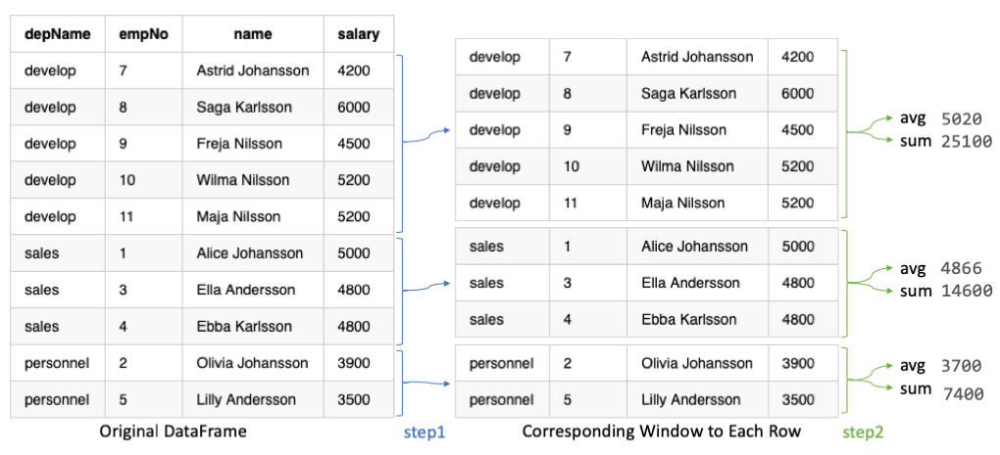

In the example, in the previous graph and the following code, we calculate 

- using function `avg` to calculate average salary in a department 
- using function `sum` to calculate total salary in a department

Here is the sample code

    val overCategory = Window.partitionBy('depName)
    val df = empsalary.withColumn(
      "salaries", collect_list('salary) over overCategory).withColumn(
      "average_salary", (avg('salary) over overCategory).cast("int")).withColumn(
      "total_salary", sum('salary) over overCategory).select(
       "depName", "empNo", "name", "salary", "salaries", "average_salary", "total_salary")
    df.show(false)

Here is the output from the previous sample code. 

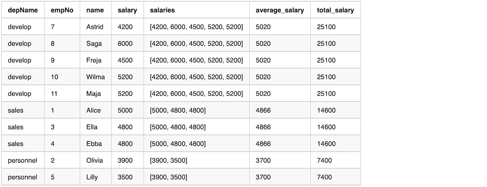

From the output, we can see that column salaries by function `collect_list` has the same values in a window.

## Ordered Frame with `partitionBy` and `orderBy`

An **Ordered Frame** has the following traits.

- Created with `Window.partitionBy` on one or more columns
- Followed by `orderBy` on a column
- Each row have a corresponding frame
- The frame will NOT be the same for every row within the same partition. By default, the frame contains all previous rows and the currentRow.
- Aggregate/Window functions can be applied to each row+frame to generate a value

Here is the sample code

    val overCategory = Window.partitionBy('depName).orderBy('salary desc)
    val df = empsalary.withColumn(
      "salaries", collect_list('salary) over overCategory).withColumn(
      "average_salary", (avg('salary) over overCategory).cast("int")).withColumn(
      "total_salary", sum('salary) over overCategory).select(
       "depName", "empNo", "name", "salary", "salaries", "average_salary", "total_salary")
    df.show(false)

Here is the output from the previous sample code. 

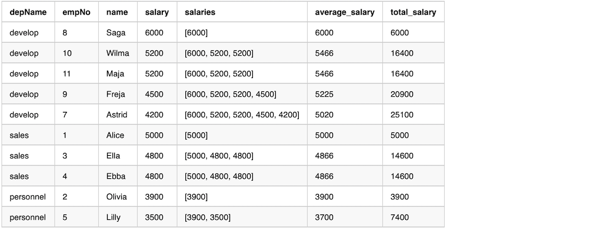

From the output we can see that column salaries by function `collect_list` does NOT have the same values in a window. 
The values are only from `unboundedPreceding` until `currentRow`. 

The `average_salary` and `total_salary` are not over the whole department, but average and total for the salary higher or equal than `currentRow`'s salary.

## Rank functions in a group

Here is a table of all the rank functions supported in Spark.

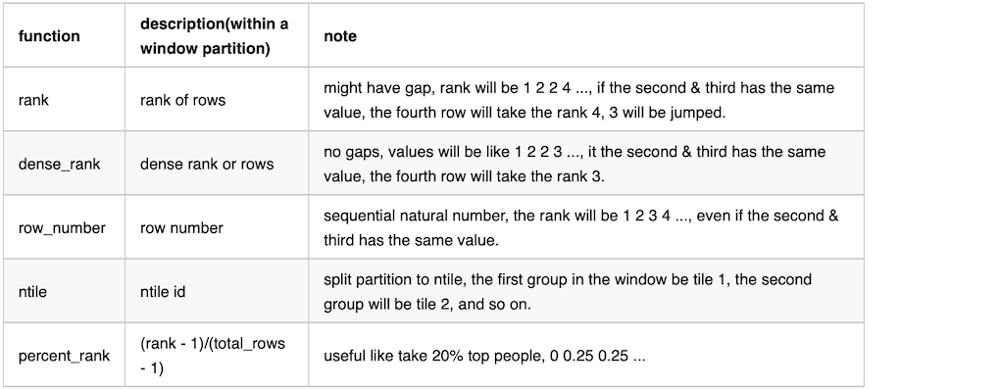

Here is the sample code 

    val overCategory = Window.partitionBy('depName).orderBy('salary desc)
    val df = empsalary.withColumn(
      "salaries", collect_list('salary) over overCategory).withColumn(
      "rank", rank() over overCategory).withColumn(
      "dense_rank", dense_rank() over overCategory).withColumn(
      "row_number", row_number() over overCategory).withColumn(
      "ntile", ntile(3) over overCategory).withColumn(
      "percent_rank", percent_rank() over overCategory).select(
       "depName", "empNo", "name", "salary", "rank", "dense_rank", "row_number", "ntile", "percent_rank")
    df.show(false)

Here is the output from the previous sample code. 

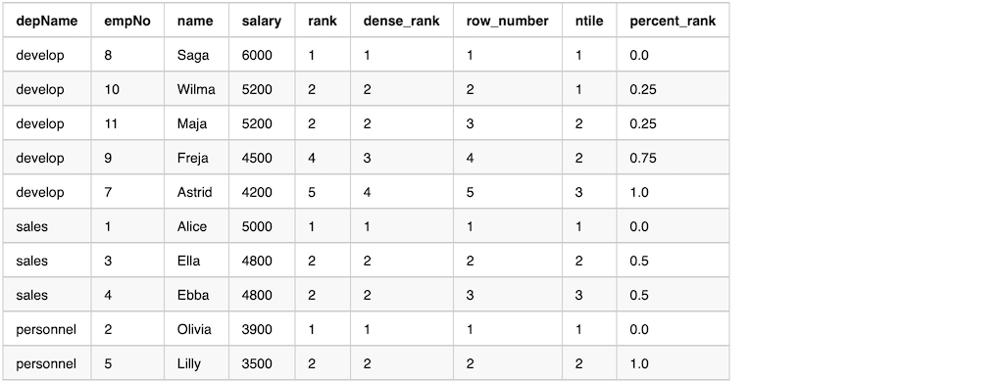

After using the rank function, we can easily filter to get the rows we want. 

The following example keeps the top 2 employees salary wise, others have to go. 
On the sample dataset, Wilma and Maja have the same salary. 
Maja has to go according to order, unfortunately. 

    val overCategory = Window.partitionBy('depName).orderBy('salary desc)
    val df = empsalary.withColumn(
      "row_number", row_number() over overCategory).filter(
      'row_number <= 2).select(
      "depName", "empNo", "name", "salary")
    df.show(false)

## lag & lead in a group

`lag` and `lead` can be used, when we want to get a relative result between rows.
The real values we get are depending on the order. 

`lag` means getting the value from the previous row; `lead` means getting the value from the next row.
 
The following example adding rows with lead and lag salary.

    val overCategory = Window.partitionBy('depname).orderBy('salary.desc)
    val df = empsalary.withColumn(
      "lead", lead('salary, 1).over(overCategory)).withColumn(
      "lag", lag('salary, 1).over(overCategory)).select(
          "depName", "empNo", "name", "salary", "lead", "lag")
    df.show(false)
    
Here is the output from the previous example

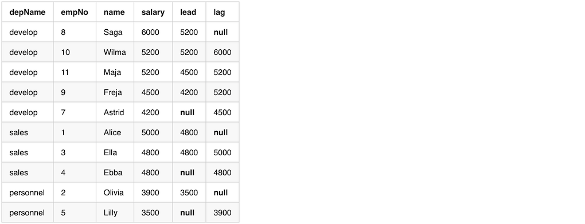

Notice from the output, the first row in a window with `lag` will have value **null**, and the last row in a window with `lead` will have value **null**

We can calculate the difference with `lead` and `lag` compare the `currentRow`. While since either the first/last value will be **null**, so one of difference value will be **null**.

    val diff = df.withColumn(
        "higher_than_next", 'salary - 'lead).withColumn(
        "lower_than_previous", 'lag - 'salary)
    diff.show()

We can replace the value **null** after getting the difference. Or like this example, using `when` to calculate the difference, fill in a literal value, e.g 0.

    val diff = df.withColumn(
      "higher_than_next", when('lead.isNull, 0).otherwise('salary - 'lead)).withColumn(
      "lower_than_previous", when('lag.isNull, 0).otherwise('lag - 'salary))
    diff.show()
    
We can, after calculating the difference, find some outliers which have a huge salary gap. 
The following example takes employees whose salary is double to the next employee.

    diff.filter('higher_than_next > (lit(2) * 'salary)).show(false)
    
    
## Running Total 

**Running Total** means adding everything up until the `currentRow`

Example code to calculate running total. 

    val overCategory = Window.partitionBy('depname).orderBy('salary desc)

    val running_total = empsalary.withColumn(
      "rank", rank().over(overCategory)).withColumn(
      "costs", sum('salary).over(overCategory)).select(
      "depName", "empNo", "name", "salary", "rank", "costs")
    running_total.show(false)

Here is the output. 

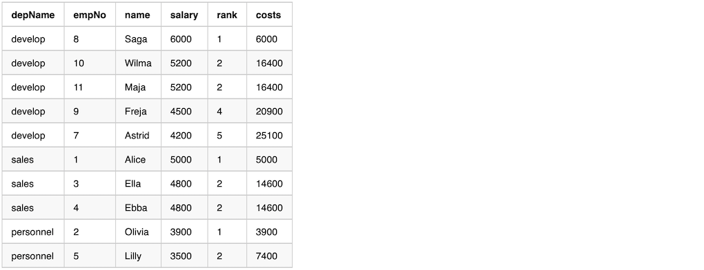

Depending on the example behavior we want, we might get row_number first, then calculate the running total.  

    val overCategory = Window.partitionBy('depname).orderBy('salary desc)
    val overRowCategory = Window.partitionBy('depname).orderBy('row_number)

    val running_total = empsalary.withColumn(
      "row_number", row_number() over overCategory).withColumn(
      "costs", sum('salary) over overRowCategory).select(
      "depName", "empNo", "name", "salary", "row_number", "costs")
    running_total.show(false)
    
    
## Range Frame

We can use range functions to change frame boundary. 

- Create with `Window.partitionBy` on one or more columns
- It usually has `orderBy` so that the data in the frame is ordered.
- Then followed by `rangeBetween` or `rowsBetween`
- Each row will have a corresponding frame
- Frame boundary can be controlled by `rangeBetween` or `rowsBetween`
- Aggregate/Window functions can be applied on each row+frame to generate a single value

There are two range window functions, here are the functions definitions

    def rowsBetween( start: Long, end: Long): WindowSpec
    
    def rangeBetween(start: Long, end: Long): WindowSpec

both functions accept two parameters, [start, end] all inclusive. The parameters value can be `Window.unboundedPreceding`, `Window.unboundedFollowing`, and `Window.currentRow`. Or a value relative to `Window.currentRow`, either negtive or positive.

`rowsBetween` get the frame boundary based on the row index in the window compared to `currentRow`. here are a few examples and it's meaning. 

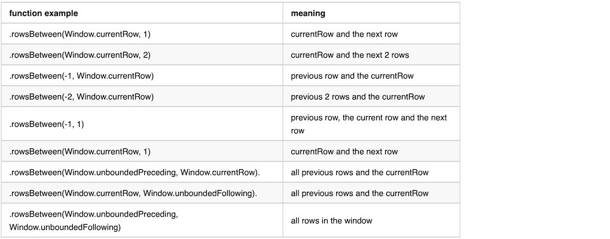

`rangeBetween` get the frame boundary based on row **value** in the window compared to `currentRow`. The difference compares to `rowsBetween` is that it compare with **value** of the current row. 

Here is the value definition of the constant values used in range functions.

> Window.currentRow = 0
> 
> Window.unboundedPreceding = Long.MinValue
>
> Window.unboundedFollowing = Long.MaxValue

Here is an example use directly after `Window.partitionBy`, without an `orderBy`. We can see from the output that the data in the window is random.

    val overCategory = Window.partitionBy('depName).rowsBetween(
      Window.currentRow, 1)
    val df = empsalary.withColumn(
      "salaries", collect_list('salary) over overCategory).withColumn(
      "total_salary", sum('salary) over overCategory)
    df.select("depName", "empNo", "name", "salary", "salaries", "total_salary").show(false)

The output from the previous example

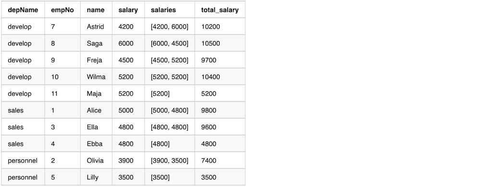

Here is an example use after `Window.partitionBy` and `orderBy`. The data in the window is ordered.

    val overCategory = Window.partitionBy('depName).orderBy('salary desc).rowsBetween(
       Window.currentRow, 1)
    val df = empsalary.withColumn(
      "salaries", collect_list('salary) over overCategory).withColumn(
      "total_salary", sum('salary) over overCategory)
    df.select("depName", "empNo", "name", "salary", "salaries", "total_salary").show(false)

The output from the previous example

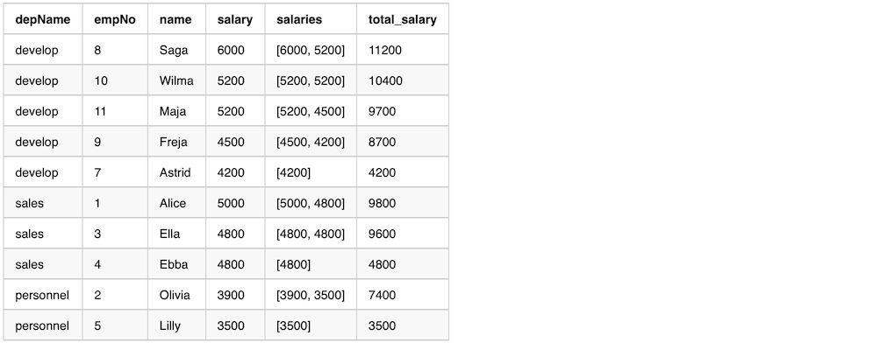

## Median

`mean`(`avg`) and `median` are commonly used in statistics. In certain cases `median` are more robust comparing to mean, since it will filter out outlier values.

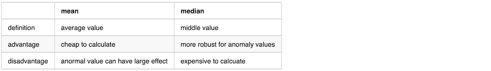
|             | mean   | median |
|:------------|:-------|:-------|
| definition  | average value | middle value |
| advantage   | cheap to calculate | more robust for anomaly values |
| disadvantage| anormal value can have large effect | expensive to calcuate

We can either using Window function directly or first calculate the median value, then join back with the original data frame.

### Use Window to calculate median

We can use window function to calculate the median value. Here is an example

    val overCategory = Window.partitionBy('depName).orderBy('salary).rowsBetween(
      Window.unboundedPreceding, Window.unboundedFollowing)
    
    val df = empsalary.withColumn(
      "salaries", collect_list('salary) over overCategory).withColumn(
      "median_salary", element_at('salaries, (size('salaries)/2 + 1).cast("int")))
    df.select("depName", "empNo", "name", "salary", "salaries", "median_salary").show(false)

The output from the previous example

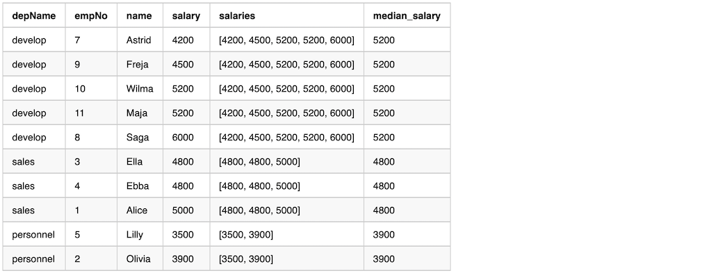

### Use groupBy then join back to calculate the median value

We can calculate the median value first, then join back with the original DataFrame. Here is an example

    val dfMedian = empsalary.groupBy("depName").agg(
      sort_array(collect_list('salary)).as("salaries")).select(
      'depName, 'salaries, element_at('salaries, (size('salaries)/2 + 1).cast("int")).as("median_salary"))
    val df = empsalary.join(broadcast(dfMedian), "depName").select(
        "depName", "empNo", "name", "salary", "salaries", "median_salary")
    df.show(false)

The output from the previous example. 

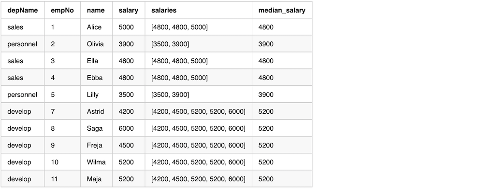

## References

- [Spark API WindowSpec](http://spark.apache.org/docs/latest/api/scala/index.html#org.apache.spark.sql.expressions.WindowSpec)
- [Spark API functions](http://spark.apache.org/docs/latest/api/scala/index.html#org.apache.spark.sql.functions)
- [mastering-spark-sql](https://jaceklaskowski.gitbooks.io/mastering-spark-sql/spark-sql-functions-windows.html)
- [Introducing Window Functions in Spark SQL](https://databricks.com/blog/2015/07/15/introducing-window-functions-in-spark-sql.html)
