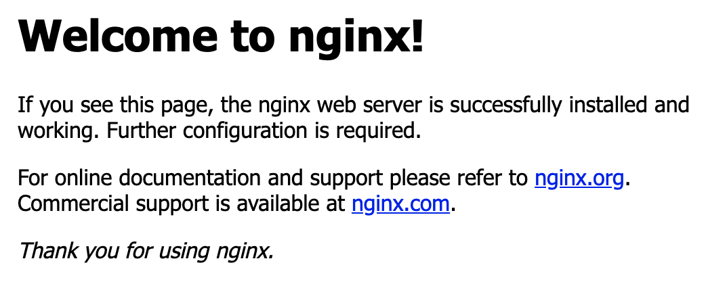

# Nginx Tutorial Step by Step with Examples

Nginx is a web server which can also be used as a reverse proxy, load balancer, mail proxy and HTTP cache. The software was created by Igor Sysoev and first publicly released in 2004. 

I got a chance to work with a project using nginx intensively. On the way, I spend some time experimenting with it. Here I record down my exploration of nginx. 

## Step 0 - Environment Preparation

We can install nginx in a physical machine, a virtual machine, a docker container. 

For fast experient, I use docker for all the examples below. There are two prerequisites needed for the following examples

- Docker Installed
- Have Internet Connection, might need turn off VPN, firewall if you are with some company network.

Fow Mac and Window, we can use docker desktop. Just download from the [link](https://www.docker.com/products/docker-desktop), and install it.

For Linux, download a docker image with your preferred distribution using one of the links below. 

- [CentOS](https://docs.docker.com/install/linux/docker-ce/centos/)
- [Debian](https://docs.docker.com/install/linux/docker-ce/debian/)
- [Fedora](https://docs.docker.com/install/linux/docker-ce/fedora/)
- [Ubuntu](https://docs.docker.com/install/linux/docker-ce/ubuntu/)
- [Others Distributions](https://docs.docker.com/install/linux/docker-ce/binaries/)

## Step 1 - A Simple HTTP Server

We will use the official nginx docker image in the article. The version tested is 1.15. Other version shall working as well.

Execute the following command 

	docker run -it --name nginx --rm -p 8080:80 nginx:1.15

| option     | meaning |
|:-----------|:--------|
| -it        |: interactive model
|--name nginx| the docker container name is nginx so that we can easily removed later
|--rm.       |: remove the container if we stop it
|-p 8080:80  | map container port 80 to 8080 of the host 
|nginx:1.15  | Using nginx image, with specific version 1.15

We can now open this link [http://localhost:8080/](http://localhost:8080/) with a web browser. Something like this shall appear.

<kbd>
</kbd>

## Step 2 - A Simple File Server

By default, nginx's main configuration is `/etc/nginx/nginx.conf`. From the configuration file `nginx.conf`, we shall notice some lines like this which is used to include sub configuration files

	include /etc/nginx/conf.d/*.conf;
	
The nginx image comes with a default configuration file `/etc/nginx/conf.d/default.conf`. It shall have some content like this.

	server {
	    listen       80;
	    server_name  localhost;
		
	    location / {
	        root   /usr/share/nginx/html;
	        index  index.html index.htm;
	    }
    }
    
| configuration line            | meaning |
|:------------------------------|:--------|
| server                        | server block use the server_name and listen directives to bind to tcp sockets. It serve similar function as Apache
|listen       80;               | listen to port 80, by default it's HTTP port, in the next example we will use HTTPS
|server_name  localhost;        | It can be a domain name or just simple a machine name
|location /                     | location block, / correspond to root location. for example the data will be get from folder /usr/share/nginx/html when we access http://localhost/
|root   /usr/share/nginx/html;  | root folder for the location block, files include files in sub directories can be accessed with the location.
|index  index.html index.htm;   | if we do not specify file, but only directory, it will first looking for index.html, if could not find index.html try index.htm 

Run the following command to start a simple file server. We are set the current folder `$(pwd)` as the root folder. It will be accessable by `http://localhost:8080/`.

	docker run -d --name nginx --rm -p 8080:80 -v $(pwd):/usr/share/nginx/html nginx:1.15
	
Now we can access the files in the folder. Depending on the file type, the browser might just open it, or download it.

- [http://localhost:8080/index.html](http://localhost:8080/index.html): For HTML file, a browser will be just open it, and render it
- [http://localhost:8080/test.txt](http://localhost:8080/test.txt): For text file, a broswer will likely open it.
- [http://localhost:8080/run.sh](http://localhost:8080/run.sh): For sh file, a browser will likely download it.

The default configuration inside the docker container can be checked with following command

    docker exec -it nginx cat /etc/nginx/nginx.conf
    docker exec -it nginx cat /etc/nginx/conf.d/default.conf
    
## Step 3 - HTTPS

Data is not encrypted on transit when we using HTTP. It means any machine along the way will be able to see the data you send and received. For example, all machine connected to the same WIFI hotspot as you will be able to see your content.

HTTPS provide encryption for data on transit. Machines along the way will only see the encrypted data. 

For HTTPS to work, we need to generate a keypair and obtain a certificate for the public key. There are various alternative for obtaining a certificate.
- Using self signed certificate
- Obtain a free public key certificate through [https://letsencrypt.org/](https://letsencrypt.org/)
- Obtain public key certificate through a third party certificate authority.

For simplicity, we will just be using a self signed certificate. 

Run the following command to generate a certificate and a private key. Just accept all the default values.

	openssl req -x509 -nodes \
	  -days 365 \
	  -newkey rsa:2048 \
	  -keyout example.key \
	  -out example.crt
	  
Create a configuration file `https.conf` with following content.

	server {
	    listen 443 ssl;
	    server_name www.example.com;
		
	    ssl_certificate /etc/nginx/ssl/example.crt;
	    ssl_certificate_key /etc/nginx/ssl/example.key;
	
	    location / {
	        root /usr/share/nginx/html;
	        index index.html index.htm;
	    }
	}

Compare to the previous configuration for HTTP. There are few differences which listed in the following table

| configuration line            | meaning |
|:------------------------------|:--------|
|listen 443 ssl;                                | Listening on port 443, with SSL encryption on
|ssl_certificate /etc/nginx/ssl/example.crt;    |SSL certificate file, either created with self signed way or obtained |
|ssl_certificate_key /etc/nginx/ssl/example.key;|SSL certificate key, the private key for the certificate

Run the following command. The configuration, certificate, and key are mounted in the command.

	docker run -it --rm --name nginx -p 8443:443 \
	    -v $(pwd)/https.conf:/etc/nginx/conf.d/https.conf \
	    -v $(pwd)/example.key:/etc/nginx/ssl/example.key \
	    -v $(pwd)/example.crt:/etc/nginx/ssl/example.crt nginx:1.15
	    	    
Open a browser with link [https://localhost:8443](https://localhost:8443). We will just be warned by the browser that you connection is not private. Something like this.

<kbd>

</kbd>

Just click <kbd>Adavand</kbd>, and <kbd>Proceed to localhost (unsafe)</kbd>.

## Step 4 - Some Random Web Server

We need a web server for next two examples **Reverse Proxy** and **Load Balancer**.

Node.js is one of the most popular web server. We will use it to create two random web servers. It will just listening

Create a file name `serving.js` with following content.

    const http = require('http')
    const os = require('os')
    const port = 3000
    
    const requestHandler = (request, response) => {
      console.log(request.url)
      setTimeout(function() {
        response.end('Hello, This is machine learning model serving application! from ' + os.hostname())
        }, 3000);
    
    }
    
    const server = http.createServer(requestHandler)
    
    server.listen(port, (err) => {
      if (err) {
        return console.log('something bad happened', err)
      }
    
      console.log(`server is listening on ${port}`)
    })

Create another file name `seaching.js` with following content. 

    const http = require('http')
    const os = require('os')
    const port = 3000
    
    const requestHandler = (request, response) => {
      console.log(request.url)
      setTimeout(function() {
        response.end('Hello, This is machine learning model hyper parameters searching Server! from ' + os.hostname())
        }, 3000);
    
    }
    
    const server = http.createServer(requestHandler)
    
    server.listen(port, (err) => {
      if (err) {
        return console.log('something bad happened', err)
      }
    
      console.log(`server is listening on ${port}`)
    })
	
The two files, `serving.js` and `searching.js` are almost identical with only small different to the response message. They are just listening on port 3000 and return back a message. The response message also include the `hostname`, so that we know which server was processing the request.
 	
Run the following command to start the serving application.

	docker run -it --rm --name serving \
	  -p 3000:3000 \
	  -v $(pwd)/serving.js:/bin/serving.js \
	  node:11.12 node /bin/serving.js

Run the following command to start the searching application.

	docker run -it --rm --name searching \
	  -p 3001:3000 \
	  -v $(pwd)/searching.js:/bin/searching.js \
	  node:11.12 node /bin/searching.js
	  
Access [http://localhost:3000](http://localhost:3000) for the model seving application. 

Access [http://localhost:3001](http://localhost:3001) for the model searching application. 

## Step 5 - Reverse Proxy

**Proxy** (or sometime called **Forward Proxy**) is used when we wanna access internet from internal network. The computer on the boundary is acting as a proxy server. In the following image, there are 3 clients connect to the Forward Proxy. And the foward proxy is the only communication port to internet.

**Reverse Proxy** on the other side is used when internet user wanna access services inside a data center. The computer on the boundary is acting as reverse proxy. It provide a single entry for **different** services hosted inside a data center. In quite quite some cases a Reverse Proxy is used to terminiate HTTPS traffic, so that the internal service don't have to deal with security setup.

We will use docker-compose for the example. Create file `docker-compose.yml` with following content. 3 instances is included in the docker-compose, a nginx act as **Reverse Proxy**, serving service, and searching service.

    version: '3'
    services:
      nginx:
        image: nginx:1.15
        ports:
          - "8080:80"
          - "8443:443"
        volumes:
          - ./http.conf:/etc/nginx/conf.d/default.conf
          - ./https.conf:/etc/nginx/conf.d/https.conf
          - ./example.key:/etc/nginx/ssl/example.key
          - ./example.crt:/etc/nginx/ssl/example.crt
        depends_on:
          - serving
          - searching
      serving:
        image: node:11.12
        hostname: serving
        ports:
          - "3000:3000"
        volumes:
          - ./serving.js:/bin/serving.js
        command: bash -c "node /bin/serving.js"
      searching:
        image: node:11.12
        hostname: searching
        ports:
          - "3001:3001"
        volumes:
          - ./searching.js:/bin/searching.js
        command: bash -c "node /bin/searching.js"

Create file `http.conf` with following content. It listen on port 80, with plain HTTP. It will forward all the traffic to `http://serving:3000/` if accessed with `/serving/`; and will forward all the traffic to `http://searching:3001/` if accessed with `/searching/`

    server {
      listen 80;
      location /serving/ {
        proxy_pass http://serving:3000/;
      }
    
      location /searching/ {
        proxy_pass http://searching:3001/;
      }
    }

Create file `https.conf` with following content. The foward setup is extractly as `http.conf`. The only difference is it listen on port 443 with SSL encryption. In this case it used as HTTPS termination. The traffic coming in, is encypted on port 443, then forward to an unecrypted service on HTTP.

    server {
        listen 443 ssl;
    
        ssl_certificate /etc/nginx/ssl/example.crt;
        ssl_certificate_key /etc/nginx/ssl/example.key;
    
        location /serving/ {
            proxy_pass http://serving:3000/;
        }
    
        location /searching/ {
            proxy_pass http://searching:3001/;
        }
    }

Run the following command to start the whole cluster

	docker-compose up
	
We can now access, which works as pure reverse proxy

- [http://localhost:8080/serving](http://localhost:8080/serving), will access the logic 
- [http://localhost:8080/searching](http://localhost:8080/searching)

We can now access, which works as HTTPS termination, and reverse proxy at the same time.

- [https://localhost:8443/serving](https://localhost:8443/serving)
- [https://localhost: 8443/searching](https://localhost:8443/searching)

## Step 6 - Load Balancer

**Load Balancers** are very similar with reverse proxy. 
**Reverse Proxy** will direct traffic to **different** services based on the URL or ports. 

While **Load Balancer** will  direct traffic to **the same** services. It can be used for purpose like

- Increase total capacity
- Reduce response time
- Achieve high availability
- Rolling upgrade

The main configure item to have load balancer is `upstream` in nginx. Here comes a sample configuration.

	upstream servings {
	    server "serving1:3000";
	    server "serving2:3000";
	}
	
	server {
	    listen 443 ssl;

	    ssl_certificate /etc/nginx/ssl/example.crt;
	    ssl_certificate_key /etc/nginx/ssl/example.key;
	
	
	    location / {
	        root /usr/share/nginx/html;
	        index index.html index.htm;
	    }
	
	    location /serving/ {
	        proxy_pass http://servings/;
	    }
	}
	
One upstream `servings` is defined in the example. It includes two servers, `serving1:3000` and `serving2:3000`. The upstream `servings` can then be used like a normal server like in the example.

Create a docker-composer file with following content. 

	version: '3'
	services:
	
	  serving1:
	    image: node:11.12
	    hostname: serving1
	    ports:
	      - "3000:3000"
	    volumes:
	      - ./serving.js:/bin/serving.js
	    command: bash -c "node /bin/serving.js"
	  serving2:
	    image: node:11.12
	    hostname: serving2
	    ports:
	      - "3000:3000"
	    volumes:
	      - ./serving.js:/bin/serving.js
	    command: bash -c "node /bin/serving.js"
	
	  nginx:
	    image: nginx:1.15
	    ports:
	      - "8080:80"
	      - "8443:443"
	    volumes:
	      - ./http.conf:/etc/nginx/conf.d/default.conf
	      - ./https.conf:/etc/nginx/conf.d/https.conf
	      - ./example.key:/etc/nginx/ssl/example.key
	      - ./example.crt:/etc/nginx/ssl/example.crt
	    depends_on:
	      - serving1
	      - serving2

Run the following command to start the whole cluster setup

	docker-compose up

We can now access, which works as load balancer. The response message include the node to process it. Try to refresh couple times, the message shall change randomly.

- [https://localhost:8443/serving](https://localhost:8443/serving)

## Step 7 Content Cache

The performance of applications and web sites is a critical factor in their success. People are not patient enough to wait half minutes just wanna to see a web page. 

In many cases the end user experience of your application can be improved by focusing on some very basic application delivery techniques. One such example is by implementing and optimizing caching in your application stack. nginx is quite widely as content cache layer, in front of other services.

We will use mostly same as previous example on **Load Balancer**. The first difference is add a 3 seconds to delay the reponse. 
	
	const requestHandler = (request, response) => {
	  console.log(request.url)
	  setTimeout(function() {
	    response.end('Hello, This is machine learning model serving application! from ' + os.hostname())
	    }, 3000);
	}

The other change is add cache configuration, like this.

	upstream servings {
	    server "serving1:3000";
	    server "serving2:3000";
	}
	
	proxy_cache_path /tmp/cache levels=1:2 keys_zone=my_cache:10m max_size=10g inactive=60m use_temp_path=off;
	
	server {
	    listen 443 ssl;
	
	    ssl_certificate /etc/nginx/ssl/example.crt;
	    ssl_certificate_key /etc/nginx/ssl/example.key;
	
	    location / {
	        root /usr/share/nginx/html;
	        index index.html index.htm;
	    }
	
	    location /serving/ {
	        proxy_pass "http://servings/";
	        proxy_buffering        on;
	        proxy_cache            my_cache;
	        proxy_cache_valid      200  1d;
	        proxy_cache_use_stale  error timeout invalid_header updating
	        http_500 http_502 http_503 http_504;
	    }
	}
	
The most important part is `proxy_cache_path` which the cache will be stored. 

Run the following command to start the whole cluster setup

	docker-compose up
	
Access [https://localhost:8443/serving](https://localhost:8443/serving). And try to refresh. You shall notice, the response will return in 3 seconds. While for the later access with reflesh it, you will get the the response immediately since it is cached by nginx.

We can check the cache content inside the nginx server. Attach to docker container with command `docker exec -it step7-cache_nginx_1 bash`. All the cache content are under `/tmp/cache`

	root@6a2082f9692f:/tmp/cache# cat /tmp/cache/f/e9/6999fdd42906a0737533b155d95a5e9f 
	?=?\????????[?\uz?lg?
	KEY: http://servings/
	HTTP/1.1 200 OK
	Date: Tue, 09 Apr 2019 19:02:51 GMT
	Connection: close
	
	Hello, This is machine learning model serving application! from serving1

## References

Nginx is a powerful application. There are many things can be realized with nginx. I bared scratch the surface of a big iceberg. 

All the code can be found on [https://github.com/rockie-yang/explore-nginx](https://github.com/rockie-yang/explore-nginx)

Here is a list of doc, I refered.

- [nginx doc](https://nginx.org/en/docs/)
- [agentzh-nginx-tutorials](https://openresty.org/download/agentzh-nginx-tutorials-en.html)

