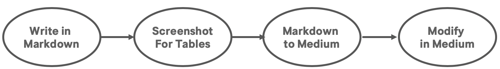

# An End-to-End Way to Publish MarkDown Stories to Medium

[medium.com](medium.com) is a great platform with many great articles. While publishing stories from markdown files to medium is not as smooth as it could be. Here is one way end to end way to publish markdown stories to medium.

Tools used

- [barryclark/jekyll-now](https://github.com/barryclark/jekyll-now) which enable write blog in markdown and automatically publish to github.io
- [http://markdown-to-medium.surge.sh/](http://markdown-to-medium.surge.sh/) copy markdown file and get content in medium format. code is hosted at github [fanderzon/markdown-to-medium-tool](https://github.com/fanderzon/markdown-to-medium-tool)
- [macdown](https://macdown.uranusjr.com/) for markdown editor
- take screenshot, **Command** + **Shift** + **4**

> NOTE: It might work directly import from github.io with jekyll-now. 

## Write in Markdown

This is a normal step to write down the idea. Tools like MacDown enable us to see the direct effact.

### Article Title

Jykell using file name to annotable the title of the article. For example, file 2019-04-30-Nginx-Tutorial-Step-by-Step-with-Examples.md will have title **Nginx Tutorial Step by Step with Examples**. 

While title in medium need use the top header like

<pre>
# Nginx Tutorial Step by Step with Examples
</pre>

### Article Tags

Jykell using tags like the following example, so that can be optimized by SEO.

<pre>
---
layout: post
title: Nginx Tutorial Step by Step with Examples
comments: true
tags: nginx, reverse proxy, load balancer, CDN, content cache
---
</pre>

This how ever need be removed after pasted medium. And need be added manually on medium. This will be covered in the last section **Modify in Medium**

### Kbd tag

\<kbd> tab will be rendered niced on Jykell. like <kbd>tab</kbd>

While this is not supported on **Medium**. An easiest way will be using bold by quoted with **. 

## Screenshot for Tables

Medium does not support tables with markdown. One of the way to use tables will be take screenshot.

### Add Tables to Markdown

Write something like this. 

<pre>
| Country | Capital |
|:--------|:--------|
|China    |Beijing  |
|Sweden   |Stockholm|
</pre>

- **| Country | Capital |** is the header. 
- **|:--------|:--------|** is the separation between the header and content. 
- Other rows are content

It will be rendered nicely by MacDown like this.

| Country | Capital |
|:--------|:--------|
|China    |Beijing  |
|Sweden   |Stockholm|

## Screenshot for Tables

Take screenshot for all the tables with **Command** + **Shift** + **4**.

Modify screenshot filenames

Copy all screenshot file to images folder of the jykell-now repo

### Add images to markdown

In Jykell and MacDown, we can use relative path like

<pre>

</pre>

It will not be able to resolved when we import to medium. So we need use absolute folder instead, like this.

<pre>

</pre>

## Markdown to Medium

Copy and Paste the markdown content to [http://markdown-to-medium.surge.sh/](http://markdown-to-medium.surge.sh/) on the left pane.

Copy the content on the right pane.

Create a new story on medium and paste the content.

## Modify on Medium

### Remove table content in markdown format

table content in markdown format is the orginal content we wanna keep in markdown as plain text for future editing.

This need be deleted on medium.

### Add Tags

### Add Cover Images

### First Chapter

Medium treat the first chapter (140 characters) as abstract. It might need be adjusted a bit.