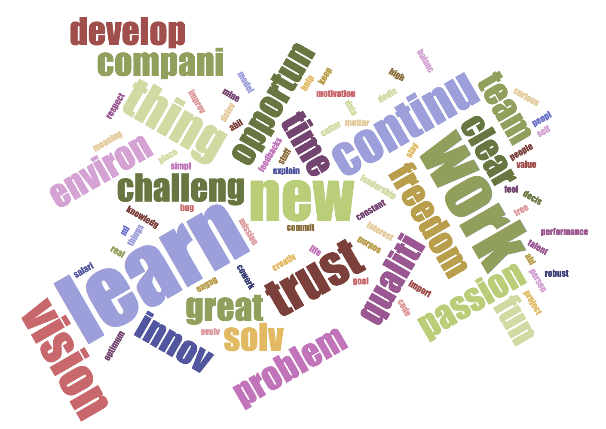

## Engineers' preference as an employee - A small survey

As an engineer, I value certain things more than the others as an employee. To have a comprehensive view on the perference, an anonymous survey was conducted on the attendees in a technical meetup event [Big Data and Machine Learning Pipeline @ Tink](https://www.meetup.com/Knock-Data-Stockholm/events/264982580/). [Apache Spark](https://spark.apache.org) is used to anaylze the survey data in case that the data size increases in the future.

The question used in this survey is **What is the Most Important Thing to You as an Employee**.

### Survey Answer Rate

Here is a short code to load the survey data and get the count of attendees who answered the survey, and who does not answered. 

    from pyspark.sql.functions import *
    df = spark.read.text("survey.md")
    answered = df.filter("trim(value) == ''").count()
    not_answered = df.count() - answered

Among 130 attendees, 62 answered, 68 not answered.

### Natural Language Processing (NLP)

Here is the spark code to do NLP: tokenizing into words, stemming the words and removing the stop words.

    spark-shell --packages com.github.master:spark-stemming_2.10:0.2.1

    import org.apache.spark.mllib.feature.Stemmer
    import org.apache.spark.ml.feature.StopWordsRemover
    
    val survey = spark.read.textFile("./survey.md")
    val not_empty = survey.filter("trim(value) != ''")
    val words = not_empty.map(v => v.toLowerCase.split("\\s")).toDF("words")
                        
    val stemmed = (new Stemmer()
      .setInputCol("words")
      .setOutputCol("stemmed")
      .setLanguage("English")
      .transform(words))

    val remover = (new StopWordsRemover()
      .setInputCol("stemmed")
      .setOutputCol("removed"))
    val removed = remover.transform(stemmed)
    
Here is a word cloud generated with a [word count tool](https://www.jasondavies.com/wordcloud/).

### The most frequently mentioned word

From the word cloud, the most mentioned word is learn. 
Here is a short code to get the information of the answer with most frequently mentioned word.

    df_learn = df.filter(lower(col("value")).contains("learn"))
    no_learn = df_learn.count()
    df_learn.show(no_learn, False)

There are totally 12 attendees mentioned **learn**. (# One attendee answer was **Machine Learning**, which is not exactly the same with other learn mean)
    
### Some interesting outcomes:

Beside the most frequently mentiond word **learn**, here are some of interesting answers.

* Challenging work with talented people
* Quality leadership
* Delevering code bug free and with optimum performance

Thanks for all the attendees give the answer. 

**Learning** is simply important according to the survey, while the question is more about **How to create a learning culture?** 

And **What is the Most Important Thing to You as an Employee**? 

