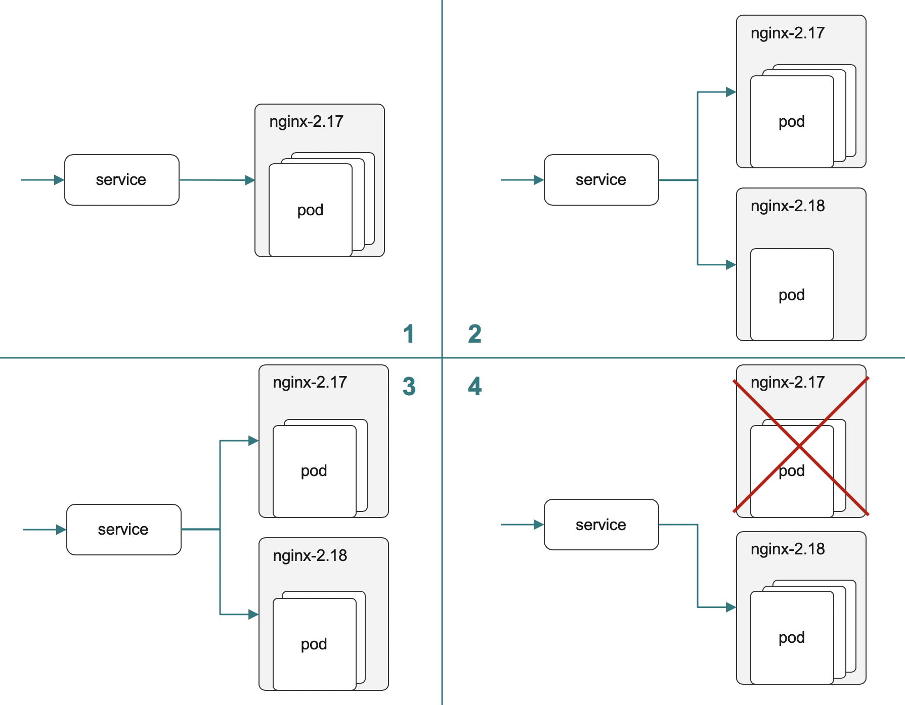
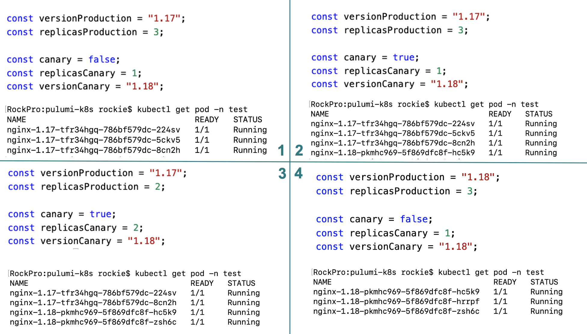

# Graceful Upgrade with Canary Deployment using Pulumi

Upgrading software to a new version is a normal procedure. 
Canary deployment is commonly used to achieve a graceful upgrade. 

This article uses Pulumi as the tool to achieve a graceful upgrade with zero interruption in a fully controlled manner. 

## What is Canary Deployment

**Canary Deployment** is a technique used to reduce the risk of introducing a new software version into production by slowly rolling out the change to a small subset of users and then rolling it out to the entire infrastructure and making it available to everybody.

For a detailed description, please refer to [description at martinfowler.com](https://martinfowler.com/bliki/CanaryRelease.html)

## What is [Pulumi](https://www.pulumi.com/)?

**Pulumi** is an open source infrastructure as code tool for creating, deploying and managing cloud infrastructure. Pulumi works with traditional infrastructures like VMs, networks, and databases, in addition to modern architectures, including containers, Kubernetes clusters, and serverless functions. Pulumi supports dozens of public, private, and hybrid cloud service providers.

By using real languages in **Pulumi** for infrastructure as code will give you many benefits including: IDEs, abstractions including functions, classes, and packaging existing debugging and testing tools, and more. The result is greater productivity with far less copy and paste, and it works the same way no matter which cloud you're targeting.


**Other approaches** use YAML, JSON, or proprietary domain-specific languages (DSLs) that you need to master and train your team to use. These alternative approaches reinvent familiar concepts like sharing and reuse, don't tap into existing ecosystems, and are often different for every cloud that you need to target.

## An Upgrade Scenario

Assume we have a web application with **[Nginx](https://www.nginx.com/)**. 

It is running in only version `1.17` in production with 3 replicas as in picture 1. 



Then we will spin up another deployment with new version `2.18` and running one replica as in picture 2. Part of the traffic will be routed to a new version whiles most of the traffic is still running the old version which was bullet tested in the production environment before.

If things go smoothly we will reduce replicas to 2 on deployment `2.17` and increase replicas to 2 on `2.18` (see picture 3). Now more traffic will be routed to the new version and less traffic routed to the old version.

Now we can reduce the replicas of the old version deployment and increase the replicas of the new version deployment until all the load is gracefully upgraded. At this stage, we can decommission the old version deployment as in picture 4.

## Step by Step

Same in the number of steps in the upgrade scenario still apply. The original state the canary upgrade has not started yet. Only version `1.17` in production with 3 replicas as in picture 1


Now set canary as `true` to start the canary deployment. We will spin up another deployment with new version `2.18` whilest running one replica as in picture 2. Part of the traffic will be routed to the new version whilest most of the traffic is still running the old version which was bullet tested in the production environment before.

If things go smoothly we reduce replicas to 2 on deployment `2.17` and increase replicas to 2 on `2.18` as in picture 3. Now more traffic will be routed to the new version and less traffic routed to the old version.

Now we can reduce the replicas of the old version deployment and increase the replicas of the new version deployment until all of the load has gracefully upgraded. At this stage, we can decommission the old version deployment as in picture 4.

## Full Code

```typescript
import * as k8s from "@pulumi/kubernetes";
import * as kx from "@pulumi/kubernetesx";

const appLabels = { app: "nginx" };

// create namespace with exact name "test" to avoid auto added suffix
const namespace = "test";
const namepapce_not_used = new k8s.core.v1.Namespace(namespace, {
    metadata: {
        name: namespace
    }
});

// Support rolling update of deployment
// max_surge, max_unavailable during rolling update
const versionProduction = "1.17";
const replicasProduction = 3;

const canary = false;
const replicasCanary = 2;
const versionCanary = "1.18";
if (canary) {
    const appLabelsCanary = { app: "nginx", version: "nginx-" + versionCanary };

    // the logical name has to be unique, so use version name as the deployment name
    const deploymentCanary = new k8s.apps.v1.Deployment("nginx-" + versionCanary, {
        metadata: {
            namespace: namespace
        },
        spec: {
            selector: { matchLabels: appLabelsCanary },
            strategy: { 
                rollingUpdate: { maxSurge: 2, maxUnavailable: 2 }, 
                type: "RollingUpdate" },
            replicas: replicasCanary,
            template: {
                metadata: { labels: appLabelsCanary },
                spec: { containers: [{ 
                    name: "nginx", 
                    image: "nginx:" + versionCanary, 
                    ports: [{ containerPort: 80 }] }] }
            }
        }
    });
}

const appLabelsProduction = { app: "nginx", version: "nginx-" + versionProduction };
const deploymentProduction = new k8s.apps.v1.Deployment("nginx-" + versionProduction, {
    metadata: {
        namespace: namespace
    },
    spec: {
        selector: { matchLabels: appLabelsProduction },

        replicas: replicasProduction,
        template: {
            metadata: { labels: appLabelsProduction },
            spec: { containers: [{ 
                name: "nginx", 
                image: "nginx:" + versionProduction, 
                ports: [{ containerPort: 80 }] }] }
        }
    }
});

const service = new k8s.core.v1.Service("nginx", {
    metadata: {
        name: "nginx",
        labels: { app: "nginx" },

        namespace: namespace
    },
    spec: {
        type: "NodePort",
        ports: [{ port: 80, targetPort: 80, nodePort: 32174 }],
        selector: { app: "nginx" }

    }
})

export const name = deploymentProduction.metadata.name;
```

## Environment

If you want to try out there 5 steps to follow. 

* Install Kubernetes environment. The simplest way will be installing [docker desktop](https://www.docker.com/products/docker-desktop) and enable Kubernetes support. 
* [Install pulumi](https://www.pulumi.com/docs/get-started/kubernetes/install-pulumi/)
* [Create a Pulumi project ](https://www.pulumi.com/docs/get-started/kubernetes/create-project/)
* Copy the previous content of code and replace the `index.ts`
* Play it