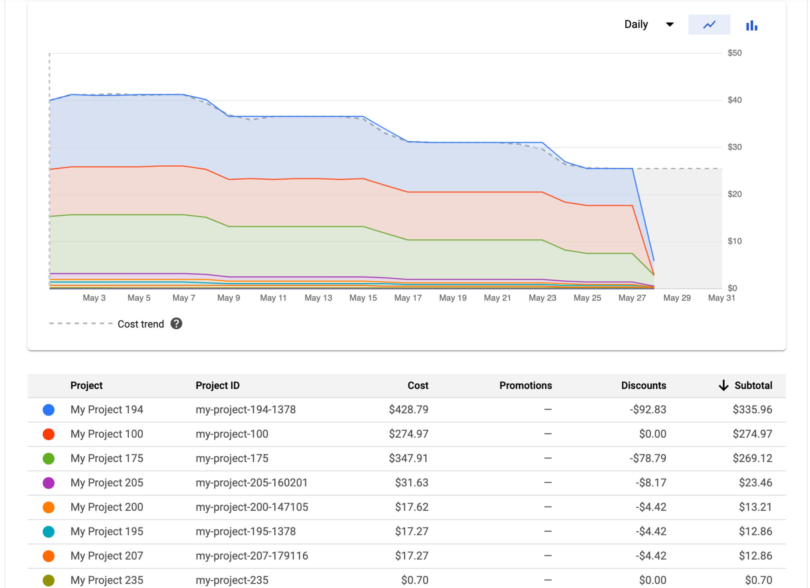
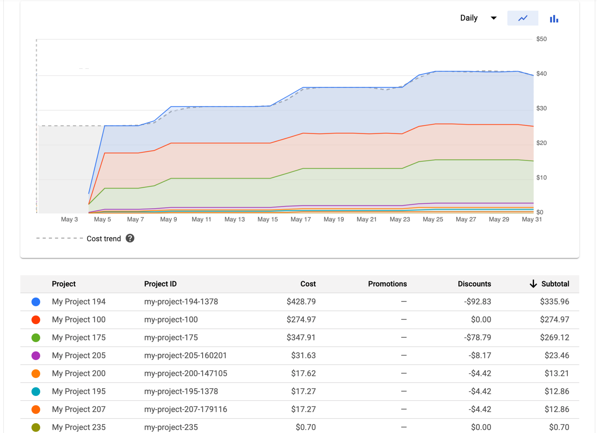

# Using CFD (Cleaning First Design) in Cloud Era to Control Your Budget

In the era of cloud computing, ways of working are very different compare with tradition on premise solution.

Here is a typical workflow of on premise solution.

Request Hardware => Budget Approval => Hardware Ordering => Hardware Delivering => Installing & Setup => Using Hardware

The time needed from request to hardware take weeks to months before it can be actually used.

Here is a typical workflow of a cloud solution.

Request Virtual Machine => Manager Approval => Virtual Machine Initialization => Using Virtual Machine

The time needed from request a virtual machine until using it will takes at most couple days.
It will barely take minutes to spin up a virtual machine and use it.

Many traits changed when time frame changed from months to minutes to spin up a virtual machine. 

The way of working in cloud era need be adapted as well to best utilize cloud infrastructure and keep everything under control 
## An extreame senarios

Sometime, sh.t happens. Assume that one of engineer commit token to public git repo, due to whatever reasons like 

- High pressure in project
- Late night working
- Not cautious enough  

And a sniffer detect this and start overuse the subscript to mine bit coin. 
A huge set of large vm instances has been started in all the regions around the world.

You as the administrator try to delete all the VMs by login to each and every region and click. 
You find your fingers are shaking outside your control to even click the right place on the screen. 

How do you deal with this situation.

## A softer version

You project has been running a year successfully. 
While the bill has been going up every month, even no extra features has been added. 

The cloud bill has almost eat up the whole revenue. 

You get the following graph when you login to your console. 

**Sorry, WRONG image**. This is a screenshot from gcp document. 
In reality, the cost shall be increase steady, similar like this chart if I just simple flip horizontally. 

## A recap of TDD (Test Driven Development)

TDD is a common software development pratice, to have contract first before the implementation. 

Here is a typical flow of TDD process

1. Add a test set to represent function contract
2. Run all tests and see if any new test fails.
3. Implement part of the function
4. Run tests
5. Repeat step 3 and 4, until all the test cases passed

